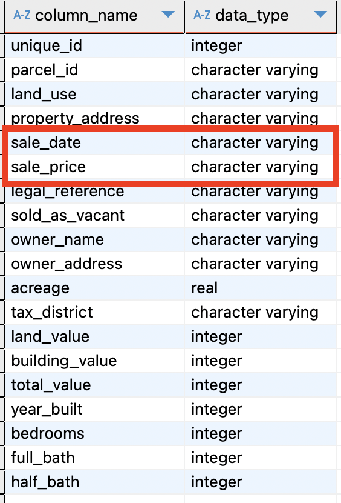
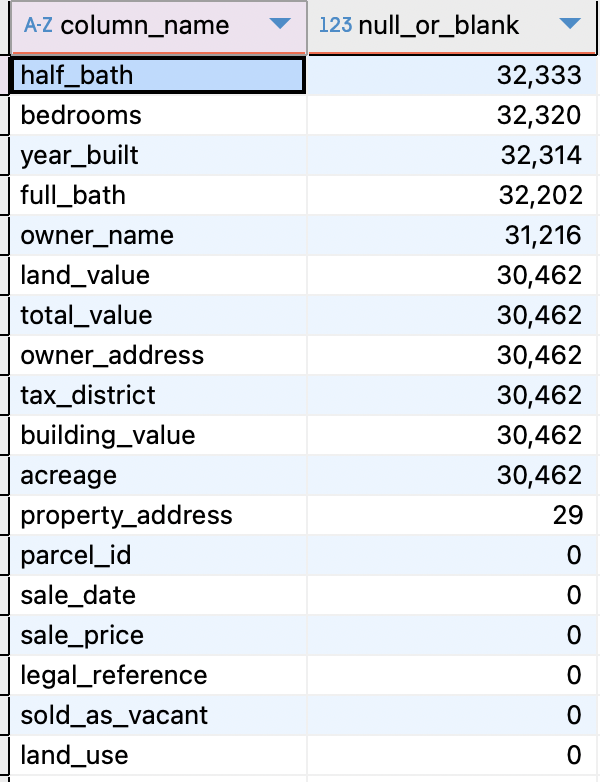
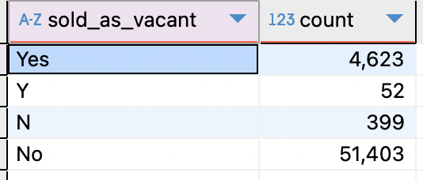

# Nashville Housing — Data Cleaning (SQL)

The Nashville Housing dataset contains records of property transactions in Nashville between 2013 and 2019, including information such as sale date, property address, sale price, etc.
The objective of this project was to clean the dataset and prepare it for reliable analysis.

## Table of Contents

* [Spotting the Issues](#spotting-the-issues)
* [Transformation](#transformation)
* [Conclusion and Recommendations](#conclusion-and-recommendations)

## Spotting the Issues
To preserve the original data a separate copy of the dataset was created:
```sql
SELECT *
INTO nashville_dataset
FROM nashville_housing_data_for_data_cleaning;
```
As a next step, the column names were standardized to snake_case to ensure consistency and improve readability across the dataset.
[Converting column names to snake_case](nashville_housing_cleaning.sql#L6-L46)

Now we are ready to start identifying issues with the dataset. The first step here is to check the data types of columns to ensure they were appropriate for the values they contained.
```sql
SELECT column_name, data_type
FROM information_schema.columns
WHERE table_schema = 'nashville' AND table_name = 'nashville_dataset';
```


Two issues were identified at this stage. The sale_date column was stored as text and needed to be converted to a date type, and the sale_price column was also stored as text and needed to be converted to a numeric type.

Next, the unique_id column was checked to confirm that it uniquely identifies each record and does not contain missing values.
```sql
SELECT COUNT(unique_id)
FROM nashville.nashville_dataset
WHERE unique_id IS NULL;
```
A duplicate check was also performed:
```sql
SELECT unique_id, COUNT(unique_id) as count
FROM nashville.nashville_dataset
GROUP BY unique_id
HAVING COUNT(unique_id) > 1;
```
Both queries returned zero rows, so unique_id was confirmed to be unique and suitable to be used as a primary identifier.

Next, the dataset was checked for missing values and blank entries across all columns. For text-based columns, both NULL values and empty strings were counted, while for numeric columns only NULL values were considered.

[Check for blanks and NULLs](nashville_housing_cleaning.sql#L63-L118)

This check helped identify which fields required trimming, normalization, or conversion of blank values into NULLs before further transformations.



Next, the sold_as_vacant column was checked for consistency. This field was expected to contain only two valid values, representing whether a property was sold as vacant or not.
```sql
SELECT sold_as_vacant, COUNT(sold_as_vacant)
FROM nashville.nashville_dataset nd
GROUP BY sold_as_vacant;
```


## Transformation

After identifying the main data quality issues, the transformation phase began. The first step was to trim whitespace from text fields and convert blank values into NULLs to ensure consistent handling of missing data.
```sql
UPDATE nashville.nashville_dataset nd
SET owner_name = NULLIF(TRIM(owner_name), ''),
owner_address = NULLIF(TRIM(owner_address), ''),
tax_district = NULLIF(TRIM(tax_district), ''),
property_address = NULLIF(TRIM(property_address ), ''),
parcel_id = TRIM(parcel_id),
land_use = TRIM(land_use),
sale_date = TRIM(sale_date),
sale_price = TRIM(sale_price),
legal_reference = TRIM(legal_reference),
sold_as_vacant = TRIM(sold_as_vacant);
```
Next, non-numeric characters were removed from the sale_price column, and the values were converted to a numeric format.
```sql
UPDATE nashville.nashville_dataset nd
SET sale_price = REPLACE(REPLACE(sale_price, '$', ''), ',', '')::NUMERIC;
```
The column data type was also updated to numeric to reflect the cleaned values.
```sql
ALTER TABLE nashville.nashville_dataset
ALTER COLUMN sale_price TYPE NUMERIC
USING sale_price::NUMERIC;
```
Next, the sale_date column was converted from text to a date type to ensure correct handling of dates in analysis.
```sql
ALTER TABLE nashville.nashville_dataset
ALTER COLUMN sale_date TYPE DATE
USING TO_DATE(sale_date, 'Month DD, YYYY');
```
Next, the sold_as_vacant column was standardized by replacing abbreviated values ('Y' and 'N') with more descriptive values ('Yes' and 'No') to improve readability and consistency.
```sql
UPDATE nashville.nashville_dataset
SET sold_as_vacant =
CASE
	WHEN sold_as_vacant='Y' THEN 'Yes'
	WHEN sold_as_vacant='N' THEN 'No'
	ELSE sold_as_vacant
END
WHERE sold_as_vacant IN ('Y', 'N');
```
Most missing values in this dataset cannot be reliably filled, but property_address is an exception. Since parcel_id refers to a specific property, the same parcel_id should have the same address.
To confirm that missing property_address values can be populated, we checked whether rows with NULL addresses share a parcel_id with other rows where the address is present.
```sql
SELECT nda.parcel_id,
nda.property_address,
ndb.parcel_id,
ndb.property_address,
COALESCE(nda.property_address, ndb.property_address) AS to_populate
FROM nashville.nashville_dataset AS nda
JOIN nashville.nashville_dataset AS ndb
ON nda.parcel_id = ndb.parcel_id AND nda.unique_id <> ndb.unique_id
WHERE nda.property_address IS NULL;
```
After confirming that missing values could be inferred, the property_address column was populated using the address from other records with the same parcel_id.
```sql
UPDATE nashville.nashville_dataset nda
SET property_address = ndb.property_address
FROM nashville.nashville_dataset ndb
WHERE nda.parcel_id = ndb.parcel_id
AND nda.unique_id <> ndb.unique_id
AND nda.property_address IS NULL
AND ndb.property_address IS NOT NULL;
```
Finally, the property_address column was split into two separate fields: address and city. This improves data usability and makes location-based analysis more straightforward.

New columns were added to store the split values, and the data was populated by extracting the street address and city from the original property_address field.
```sql
ALTER TABLE nashville.nashville_dataset
ADD COLUMN IF NOT EXISTS address TEXT,
ADD COLUMN IF NOT EXISTS city TEXT;

UPDATE nashville.nashville_dataset nd
SET address = TRIM(SUBSTR(property_address, 1, STRPOS(property_address, ',') - 1)),
city = TRIM(SUBSTR(property_address, STRPOS(property_address, ',') + 1))
WHERE property_address IS NOT NULL
AND STRPOS(property_address, ',') > 0;
```
After verifying that the address and city were correctly populated, the original property_address column was no longer needed and was safely removed from the dataset.
```sql
SELECT property_address, address, city
FROM nashville.nashville_dataset
LIMIT 20;

ALTER TABLE nashville.nashville_dataset
DROP COLUMN property_address;
```
Next, the dataset was checked for duplicate records. The assumption was that if the combination of parcel_id, sale_date, sale_price, and legal_reference is the same, the rows represent the same transaction, even if their unique_id values differ.
Based on this assumption, a duplicate check was performed to identify such records.
```sql
WITH cte AS(
SELECT unique_id, parcel_id, sale_date, sale_price, legal_reference,
COUNT(*) OVER(PARTITION BY parcel_id, sale_date, sale_price, legal_reference) AS group_count
FROM nashville.nashville_dataset
)
SELECT *
FROM cte
WHERE group_count > 1
ORDER BY parcel_id, sale_date, sale_price, legal_reference, unique_id;
```
After identifying duplicate records, the duplicates were removed while keeping one record per transaction.
For each group sharing the same parcel_id, sale_date, sale_price, and legal_reference, only the row with the smallest unique_id was retained.
```sql
WITH cte AS(
SELECT *,
ROW_NUMBER() OVER(PARTITION BY parcel_id, sale_date, sale_price, legal_reference ORDER BY unique_id) as ranking
FROM nashville.nashville_dataset
)
DELETE FROM nashville.nashville_dataset
WHERE unique_id IN (
SELECT unique_id
FROM cte
WHERE ranking > 1
);
```

## Conclusion and Recommendations

In this project, the Nashville Housing dataset was cleaned and prepared for analysis by standardizing column names, correcting data types, handling missing and inconsistent values, and removing duplicate records. Address information was normalized, categorical values were standardized, and numeric and date fields were properly converted. As a result, the dataset is now consistent, reliable, and ready for further analysis or reporting.
